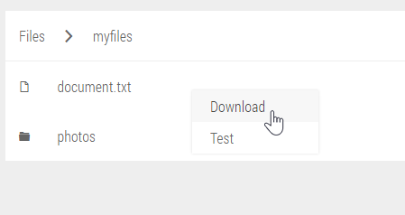

# lightcm
A lightweight contextmenu for the web.



## Install

```
$ npm install lightcm
```

or

[Download here](https://github.com/oskarbraten/lightcm/releases/download/2.0.0/lightcm.zip)

## Quick Start
```javascript
LightCM.init();

LightCM.create('mymenu', [
    {
        label: 'Open',
        attributes: {
            href: '{{url}}',
            target: '_blank'
        }
    },
    {
        label: 'Make red',
        handler: function (data, { target }) {
            target.style.background = 'red';
        }
    }
]);

```

```html
<div class="btn" data-contextmenu="mymenu" data-contextmenu-data='{ "url": "/hello "}'></div>

OR

<div class="btn" onclick="LightCM.open('mymenu', event, { url: '/hello' })"></div>
```

## Documentation

### LightCM.init(enableDataAttributes = true)
Initializes LightCM.

 * `enableDataAttributes` : \<Boolean\>
Whether or not LightCM should detect data-contextmenu attributes and add an eventlistener 

### LightCM.create(id, items)
#### Parameters:
 * `id` : \<String\>
 * `items` : \<Array\>

An item can have 3 properties:
 * `label` : \<String\>
 * `attributes` : \<Object\>
 * [`handler`](#handlerdata-event-clickevent) : \<Function\>

The `attributes` parameter is a single-depth object.  The object can contain any string, or function that returns a string. The key value pair is then applied as an attribute to the item.

#### Example:
```javascript
let items = [
    {
        label: 'Button1',
        attributes: {
            href: '{{url}}',
            target: () => '_blank' // arrow function returning '_blank'.
        }
    },
    {
        label: 'Button2',
        handler: function (data, { target }) {
            console.log(data, target);
        }
    }
];

LightCM.create('mymenu', event, items);
```
Resulting contextmenu code:
```html
<div class="context-menu" id="mymenu">
    <a class="btn" href="{{url}}" target="_blank">Button1</a>
    <a class="btn">Button2</a>
</div>
```


### LightCM.open(id, event, data)
#### Parameters:
 * `id` : \<String\>
 * `event` : \<[ContextMenuEvent](https://developer.mozilla.org/en-US/docs/Web/Events/contextmenu)\>
 * `data` : \<Object\>

Opens the contextmenu corresponding to the id.

#### Example:
```javascript
let items = [
    {
        label: 'Button1',
        attributes: {
            href: '{{url}}' // "mustache style" template
        }
    }
];

LightCM.open('mymenu', event, { url: '/hello' });
```


### handler(data, event, clickEvent)
#### Parameters:
 * [`data`](#data) : \<Object\>
 * `event` : \<[ContextMenuEvent](https://developer.mozilla.org/en-US/docs/Web/Events/contextmenu)\>
 * `clickEvent` : \<[ClickEvent](https://developer.mozilla.org/en/docs/Web/Events/click)\>

`event` is the contextmenu event.
`clickEvent` is the event from when you click a button in the contextmenu.


### data
The `data` parameter is a single-depth object. The `data` object can contain any string, or function that returns a string. These strings are then rendered in the context menu.

#### Example
```js
let items = [
    {
        label: '{{name}}',
        attributes: {
            href: '{{url}}?test=true'
        }
    }
];
let data = {
    url: '/kokiri/forest',
    name: 'Link'
};
```
Result:
```js
items[0]
>{
>   label: 'Link',
>   attributes: {
>       href: '/kokiri/forest?test=true'
>   }
>}
```
